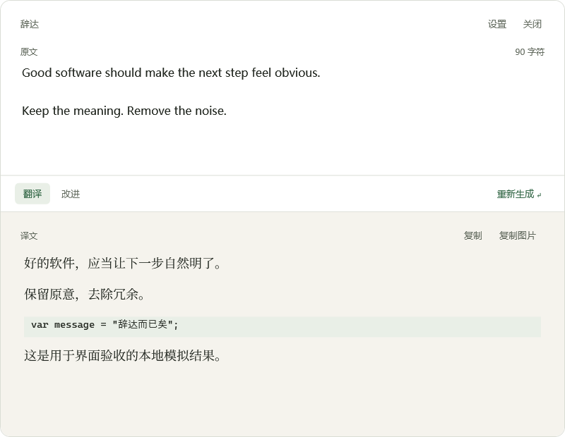
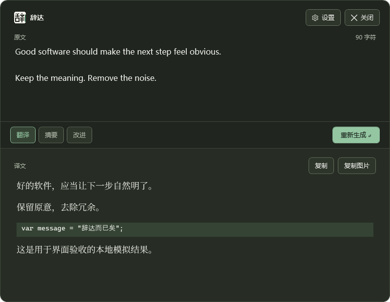

# 辞达 Cida · Windows 版

[Xuanwo/Cida](https://github.com/Xuanwo/cida) 的 Windows 移植。用你自己的模型服务翻译、改进与处理文字；WPF / .NET 10，Apache-2.0。

## 下载

[v0.2.0-rc.2 候选版](https://github.com/Oerroot/cida-win/releases/tag/v0.2.0-rc.2)：

- [Windows x64 安装包](https://github.com/Oerroot/cida-win/releases/download/v0.2.0-rc.2/Cida-win-x64-preview-Setup.exe)
- [Windows x64 便携包](https://github.com/Oerroot/cida-win/releases/download/v0.2.0-rc.2/Cida-win-x64-preview-Portable.zip)

这是**未签名候选版**。安装包与程序尚无受信任的发布者签名；Windows 可能显示未知发布者提示。请按发布页的 SHA256SUMS 校验来源。无需安装开发证书、身份包、.NET 或额外 OCR 语言包。完整解压便携包后运行根目录的 `辞达 Cida（候选版）.exe`；命令行在 `current/Cida.Cli.exe`。

已有 v0.1.3 用户可手动运行新安装包升级，或完整解压新便携包；配置沿用 `%AppData%\Cida`。新配置含动作列表，回退旧版本前请保存 `settings.json`、备份及密钥文件。旧 tag 和旧发布附件保留。

## 界面与使用



以上为真实产品视图的受控渲染，文字来自本地模拟响应。

| 默认快捷键 | 行为 |
|---|---|
| `Alt+A` | 带入前台应用选区，执行第一个启用的动作 |
| `Alt+S` | 冻结指针所在屏幕，框选、本地 OCR、翻译 |
| `Alt+D` | 翻译指针段落；再按关闭。整窗模式中可切换原文 |
| `Alt+Shift+D` | 翻译当前窗口完整可见的只读段落；再按关闭 |
| `Alt+F` | 改进选区并尝试安全替换；处理中再按取消 |

主面板采用白色输入、温暖纸色结果与绿色强调，跟随系统浅深色。中英文阅读字体随包提供。原文、结果分别滚动，长文不会把操作按钮推走。

- `Enter` 执行，`Shift+Enter` 换行，`Tab` / `Shift+Tab` 切换动作。
- `Esc` 隐藏面板；生成继续。`Ctrl+.` 停止并保留已有结果。
- `Ctrl+C` 优先复制当前选区，没有选区时复制完整结果；`Ctrl+Shift+C` 复制完整结果图片。
- `Ctrl+L` 修改常用外语，`Ctrl+,` 打开设置。
- 编辑原文、切换动作或修改请求配置会标记旧结果，由用户决定是否重新生成。

设置分为模型、动作、快捷键、通用四页。配置先编辑草稿，再保存；测试连接和动作预览不会提前保存。自定义动作可新增、改名、排序、启停与删除；翻译动作始终保留。API Key 可保留、更换或清除，使用 Windows 当前用户 DPAPI 加密保存。



## 配置模型

首次启动点击“配置模型服务”，填写完整端点、协议、模型和密钥，再测试连接。支持 OpenAI Chat Completions、OpenAI Responses、Anthropic Messages 及兼容端点；请求直接发送到用户指定的服务，不保存翻译历史。

CLI 与 GUI 共用配置。也可在设置中复制 AI 配置说明：

```powershell
.\Cida.Cli.exe config set endpoint=https://api.deepseek.com/chat/completions model=deepseek-chat
Get-Content -Raw 密钥.txt | .\Cida.Cli.exe config set api-key --stdin
.\Cida.Cli.exe check
.\Cida.Cli.exe config show --json
.\Cida.Cli.exe config schema
```

自定义动作在设置的“动作”页编辑。配置导出省略 API Key；额外请求头、请求体和自定义提示词按原样导出，如自行放入敏感信息，分享前应检查。

## OCR、原处翻译与替换

OCR 优先使用可用的 Windows 引擎，随包的 Tesseract 简体中文、繁体中文、英文资源提供离线兜底。`probe-identity` 只检查能力；`probe-ocr --offline image.png` 可验证离线识别。截图只在内存中处理。

原处翻译通过隔离子进程读取 UI Automation 文本范围，超时回收子进程。覆盖层不抢焦点、点击穿透，范围跟随窗口和滚动更新；不可编辑的正文才作为目标。代码、按钮、链接控件、密码和编辑控件会跳过。被裁切的段落暂时隐藏；无法持续跟踪或译文无法在原范围内清晰排版时转到面板。未提供可用 UIA 的应用可改用截图。

安全替换要求同一来源窗口、进程、控件、选区及文档内容，确认可编辑后才粘贴，并回读验证。无法确认时保留改进结果，先检查原文再决定是否复制。受控 WPF 编辑器已验证一次撤销恢复原文；各外部编辑器的 UIA、粘贴和撤销行为仍以实际应用为准。普通权限应用无法越过 Windows 的管理员窗口隔离。

损坏配置会保留原文件并读取上次有效备份；“通用”页可恢复备份、导出配置、查看 OCR / 热键能力和检查更新。候选版本使用 `win-x64-preview` 更新通道；下载安装更新后由用户选择重启。

## 开发与验证

```powershell
dotnet build windows -c Release
dotnet test tests/Cida.Core.Tests -c Release
dotnet test tests/Cida.Windows.Tests -c Release
$env:CIDA_DESKTOP_TESTS = '1'
dotnet test tests/Cida.Windows.Tests -c Release
Remove-Item Env:\CIDA_DESKTOP_TESTS
dotnet run --project tests/Cida.VisualChecks -- --render-suite
pwsh -File scripts/package.ps1 -Version 0.2.0-rc.2
```

交互桌面测试短暂显示自有测试窗口并保存、恢复剪贴板，运行时应关闭其他辞达进程。视觉验收工具仅使用本地模拟响应和独立配置。`CIDA_PROFILE` 可将 GUI / CLI 配置与单实例通信隔离到指定目录。

打包依赖 vpk 1.2.161 与具有合法再分发权的 Visual Studio VC runtime 文件。脚本核验 Microsoft 签名后应用本地部署运行库，检查候选包不包含私钥、证书或 MSIX，并拒绝覆盖已有版本输出。

当前证据与剩余边界见 [Windows 体验验证记录](docs/windows-experience-verification.md)。代码实现、受控渲染、真实窗口交互、干净机器安装与正式签名分别记录。完整中文 IME 候选提交、外部应用矩阵、混合 DPI 多屏、干净系统安装/升级/卸载仍不作为本候选版已通过的项目。

发布流程：添加 `docs/releases/vX.Y.Z[-rc.N].md`，提交后创建新 tag。GitHub Actions 构建、运行非交互测试、生成并上传预发布包；不会改写已有 tag 或替换既有发布附件。

## 许可与来源

[Apache-2.0](LICENSE)。上游设计及品牌来源固定到 `473013c93e052e08603ffd2faccda0d6dafbb5be`；Source Serif 4 和 Noto Serif SC 静态派生字体使用新名称 Cida Serif / Cida Chinese Serif，附 SIL OFL。OCR 引擎、模型、Leptonica 和 VC runtime 的来源、许可与哈希见 [NOTICE](NOTICE) 及随包 provenance 文件。
